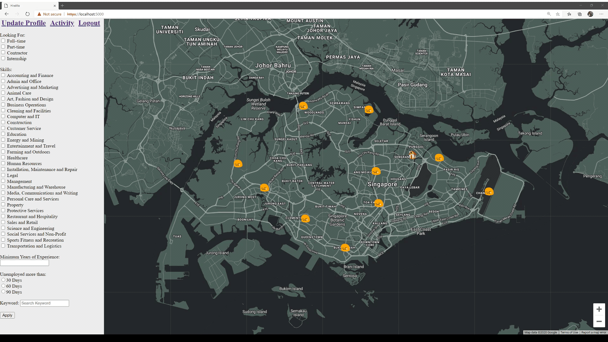

**HireMe** is a website that help unemployed people get a job and it help company to filter the right person to hire.



- [Quick Start](#quick-start)
    * [How To Setup](#how-to-setup)
    * [How To Run](#how-to-run)
    * [How To Plot](#how-to-plot)
    * [How To Remove Plot](#how-to-remove-my-plot)
    * [How To Filter](#how-to-filter)
- [FAQ](#faq)
    
    * [Future Plan](#future-plan)

# Quick Start

## How To Setup

1. Modify the `.env sample` file and renamed it to `.env`
2. Set up my SQL
    * ```docker
      docker run --name JiaHao_SQL -p 32769:3306 -e MYSQL_ROOT_PASSWORD=password -d mysql:latest
    * Using MySQL workbench to create database, Port 32769
    * 
    * ```SQL
      CREATE database my_db;
      USE my_db;
      CREATE TABLE Users (Username VARCHAR(30) NOT NULL PRIMARY KEY, Pass varbinary(255), Display VARCHAR(10), CoordX DECIMAL(20,10), CoordY DECIMAL(20,10), JobType VARCHAR(200), Skill VARCHAR(2000), Exp INT, UnemployedDate VARCHAR(20), Message VARCHAR(50), Email VARCHAR(50), AccessKey varbinary(255));
## How To Run

```go
go run HireMe
```

## How To Plot
```
1. Login/ Sign up
2. Update Profile
    * Fill up the form
3. Done
```

## How To Remove Plot
```
1. Login/ Sign up
2. Update Profile
    * Select NO
3. Done
```

## How To Filter
```
1. Go to index page
2. Update Profile
    * Fill up the form
3. Done
```

# FAQ

## Future Plan
```
Private chat between company and user to prevent user email being expose to the public.
```
